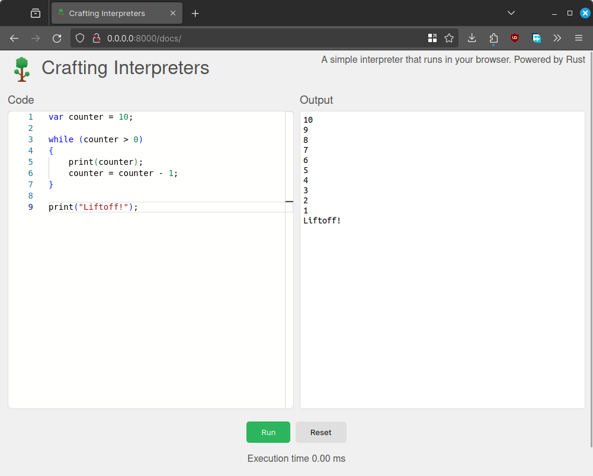

# Rust Lox Compiler

A programming language interpreter that runs in the browser (using WASM) or locally (binary executable).

[Try it online](https://agrawal-d.com/rs-lox-compiler)



Rust implementation of https://craftinginterpreters.com.

## Build & Run from source

1. Clone the repository and setup the Rust toolchain. Then, `cd` into the repository root.
1. Run `cargo install cargo-watch`.
1. Install wasm pack from https://wasm-bindgen.github.io/wasm-pack/ (`npm install -g wasm-pack`).
1. Run `generate_web.py`
1. Open `web/index.html` using a web server (like `python3 -m http.server`).

## Live Mode

```sh
# Windows
Start-Process python -ArgumentList "-m http.server" -WindowStyle Hidden
python generate_web.py --watch

# Linux
nohup python3 -m http.server > /dev/null 2>&1 &
python3 generate_web.py --watch
```

## License

Rust Lox Compiler
Copyright (C) 2026 Divyanshu Agrawal

This program is free software: you can redistribute it and/or modify
it under the terms of the GNU Affero General Public License as published
by the Free Software Foundation, either version 3 of the License, or
(at your option) any later version.

This program is distributed in the hope that it will be useful,
but WITHOUT ANY WARRANTY; without even the implied warranty of
MERCHANTABILITY or FITNESS FOR A PARTICULAR PURPOSE. See the
GNU Affero General Public License for more details.

You should have received a copy of the GNU Affero General Public License
along with this program. If not, see <https://www.gnu.org/licenses/>.
