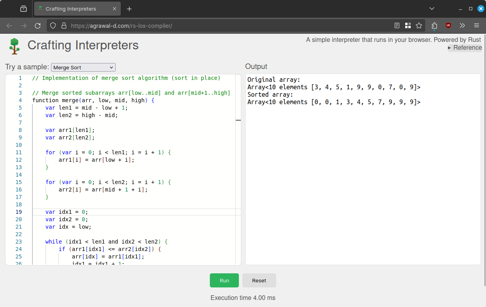

# Web Compiler

A programming language interpreter that runs in the browser.
Rust implementation of [craftinginterpreters.com](https://craftinginterpreters.com/).

[Try it online](https://agrawal-d.github.io/compiler)

## Build & Run from source

1. Run `cargo install cargo-watch `
1. Run `x.sh` (requires `bash`)
1. Open docs/index.html using a web server ( like `python3 -m http.server` )